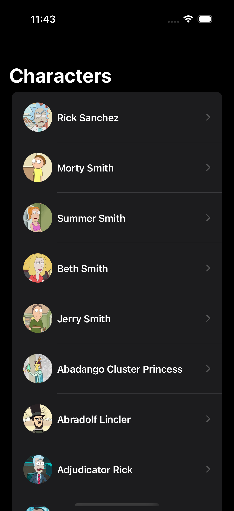
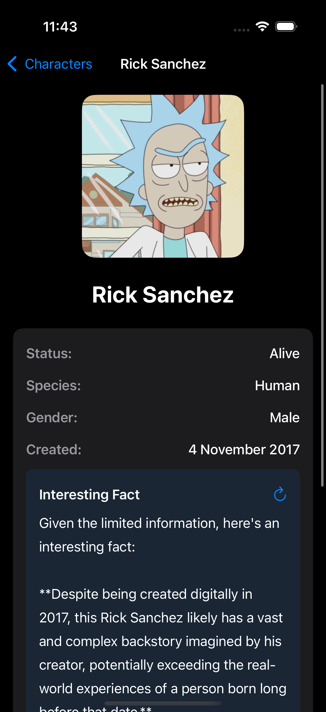

# Rick and Morty iOS App 🛸

An iOS application that explores the Rick and Morty universe using the public GraphQL API, enhanced with AI-generated character facts powered by Google Gemini.

## Features ✨

- **Character Listing**: Browse all Rick and Morty characters with smooth scrolling
- **Character Details**: View comprehensive character information including status, species, origin, and location
- **AI-Powered Facts**: Generate interesting facts about characters using Google Gemini API
- **Dark Mode Support**: Seamlessly adapts to system-wide dark/light mode preferences
- **Modern Architecture**: Built with MVVM pattern for clean separation of concerns
- **Comprehensive Testing**: Includes unit tests for reliable functionality

Screenshots 📱
 

## Architecture 🏗️

This project follows the **MVVM (Model-View-ViewModel)** architectural pattern:

- **Models**: Data structures representing Rick and Morty characters and API responses
- **Views**: SwiftUI views for character list and detail screens
- **ViewModels**: Handle business logic, API calls, and state management
- **Services**: Network layer for GraphQL API communication and Gemini AI integration

## Technical Stack 🛠️

- **Language**: Swift
- **UI Framework**: SwiftUI
- **Architecture**: MVVM
- **GraphQL Client**: Apollo iOS
- **APIs**: 
  - Rick and Morty GraphQL API
  - Google Gemini API
- **Testing**: XCTest framework (Unit Tests & UI Tests)
- **Minimum iOS Version**: iOS 15.0+

## APIs Used 🌐

### Rick and Morty GraphQL API
- **Base URL**: `https://rickandmortyapi.com/graphql`
- **Documentation**: [Rick and Morty API Docs](https://rickandmortyapi.com/documentation)
- **Usage**: Fetching character data, filtering, and pagination

### Google Gemini API
- **Purpose**: Generating interesting character facts and insights
- **Integration**: Creates unique trivia and analysis about selected characters

## Setup Instructions 🚀

1. **Clone the repository**
   ```bash
   git clone [your-repository-url]
   cd rick-and-morty-ios
   ```

2. **Open in Xcode**
   ```bash
   open GraphQL-LLM.xcodeproj
   ```

3. **API Configuration**
   - The app includes Google Gemini API keys for testing purposes
   - No additional setup required - the app is ready to run
   - Rick and Morty GraphQL API requires no authentication
   - Apollo GraphQL client is pre-configured

4. **Install Dependencies**
   ```bash
   # Apollo GraphQL is already configured
   # No additional package installation required
   ```

4. **Run the project**
   - Select your target device/simulator
   - Press `Cmd + R` or click the Run button

## Testing 🧪

The project includes comprehensive unit and UI tests covering:

- **ViewModel Logic**: Character data processing and state management
- **GraphQL Operations**: Apollo client integration and query handling
- **AI Integration**: Google Gemini API response handling and fact generation
- **Model Validation**: Data structure integrity and GraphQL schema compliance
- **UI Components**: SwiftUI view testing and user interactions

### Running Tests
```bash
# In Xcode
Cmd + U

# Or via command line
xcodebuild test -project GraphQL-LLM.xcodeproj -scheme GraphQL-LLM -destination 'platform=iOS Simulator,name=iPhone 14'
```

## Project Structure 📁

```
GraphQL-LLM/
├── GraphQL-LLM/
│   ├── GraphQL_LLMApp.swift
│   ├── Info.plist
│   ├── apollo-codegen-config.json
│   ├── schema.graphqls
│   ├── GraphQL-LLM/
│   │   ├── Detail.graphql
│   │   └── List.graphql
│   ├── Network/
│   │   └── Network.swift
│   ├── OpenAI/
│   │   ├── AIService.swift
│   │   ├── OpenAIService.swift
│   │   └── Response.swift
│   ├── ViewModels/
│   │   ├── CharacterDetailViewModel.swift
│   │   ├── CharacterFactViewModel.swift
│   │   └── CharacterListViewModel.swift
│   ├── Views/
│   │   ├── CharacterDetailView.swift
│   │   ├── CharacterDetailContentView.swift
│   │   ├── CharacterDetailRow.swift
│   │   ├── CharacterImageView.swift
│   │   ├── CharacterListView.swift
│   │   ├── CharacterRowView.swift
│   │   └── ContentView.swift
│   └── Utilities/
│       ├── Assets.xcassets
│       ├── Config.plist
│       ├── ConfigService.swift
│       └── Extensions.swift
├── GraphQL-LLMTests/
│   ├── CharacterDetailViewModelTests.swift
│   ├── CharacterListViewModelTests.swift
│   ├── GraphQL_LLMTests.swift
│   └── MockServices.swift
└── GraphQL-LLMUITests/
    ├── GraphQL_LLMUITests.swift
    └── GraphQL_LLMUITestsLaunchTests.swift
```

## Key Features Breakdown 🔍

### Character List Screen
- Displays paginated list of characters
- Search and filter functionality
- Smooth scrolling with lazy loading
- Character thumbnails and basic info

### Character Detail Screen
- Comprehensive character information
- High-resolution character image
- Status, species, origin, and location details
- AI-powered fact generation button
- Share functionality for interesting facts

### AI Integration
- Generates unique, contextual facts about characters using Google Gemini
- Uses character data to create personalized insights and trivia
- Handles API rate limits and error states gracefully
- Dedicated ViewModel for fact generation (CharacterFactViewModel)

## Dark Mode Support 🌙

The app fully supports iOS Dark Mode with:
- Automatic theme switching based on system settings
- Custom color schemes for optimal readability
- Consistent visual design across light and dark themes

## Development Notes 📝

### API Key Management
- Google Gemini API keys are intentionally left visible in Config.plist for testing purposes
- ConfigService.swift handles secure configuration loading
- In production, these should be moved to secure configuration files
- Consider using environment variables or secure key management solutions

### GraphQL Integration
- Uses Apollo iOS client for robust GraphQL operations
- Auto-generated Swift types from GraphQL schema
- Optimized queries for character listing (List.graphql) and details (Detail.graphql)
- Built-in caching and error handling through Apollo

### Performance Considerations
- Implements image caching for character thumbnails through CharacterImageView
- Uses Apollo GraphQL caching for optimal data management
- Lazy loading implemented in character list with pagination
- Optimized GraphQL queries to fetch only required data fields

## Testing & QA 🔍

This project is designed for easy testing:
- No complex environment setup required
- API keys are included for immediate functionality
- Comprehensive test coverage ensures reliability
- Clear error handling for network and API issues

## Limitations ⚠️

1. **API Key Security**: Google Gemini API key is stored in plain text in Config.plist for testing convenience
2. **Pagination**: Currently loads only the first page of characters from the GraphQL API
3. **AI Usage**: Only called AI api for one thing only

## Requirements 📋

- iOS 15.0+
- Xcode 14.0+
- Swift 5.7+
- Internet connection for API calls

---

**Note**: This app is created for as an assignment.

## Screenshots

 
